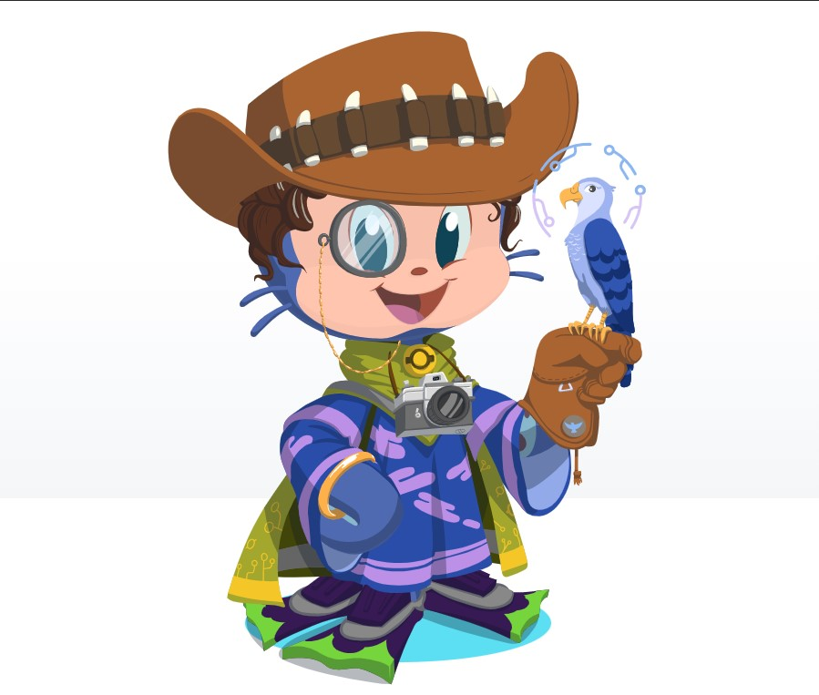

- 👋 Hi, I’m @Amoeba5558
- 👀 I’m interested in Neural Networks and Machine Learning
- 🌱 I’m currently learning web development
- 💞️ I’m looking to collaborate on anything 
- 📫 How to reach me ...
***

&copy; <span id="year"></span> Your Name

<script>
 function getCurrentYear() {
    return new Date().getFullYear();
}
document.getElementById("year").innerHTML = getCurrentYear();
</script>


***

&copy; <p id="year"></p> Your Name

<script>
  document.getElementById("year").innerHTML = new Date().getFullYear();
</script>
***

<!---
Amoeba5558/Amoeba5558 is a ✨ special ✨ repository because its `README.md` (this file) appears on your GitHub profile.
You can click the Preview link to take a look at your changes.
--->
<h1 align="center">Hi 👋, I'm Amoeba5558</h1>
<h3 align="center">A passionate frontend developer from India</h3>

# KathikShetty27's Stats
[](https://github.com/KarthikShetty27/github-readme-stats)

-----
# Amoeba5558 Stats
[](https://github.com/Amoeba5558/github-readme-stats)

---
Repository Readme Cards
***

 

[](https://github.com/KarthikShetty27/SORT)

[](https://github.com/KarthikShetty27/SORT)

---

<p align="center">  </p>


<!-- To display an Image : -->


<!--  -->
<p align="left">  </p>

<p align="left"> <a href="https://github.com/ryo-ma/github-profile-trophy"></a> </p>

- 🔭 I’m currently working on **Something Interesting**

- 🌱 I’m currently learning **Web Development**

- 💬 Ask me about **C, Cpp, Python and SQL**

- 📫 How to reach me **123@gmail.com**

<h3 align="left">Connect with me:</h3>
<p align="left">
<a href="https://linkedin.com/in/l" target="blank"></a>
<a href="https://stackoverflow.com/users/s" target="blank"></a>

</p>


<h3 align="left">Languages and Tools:</h3>
<p align="left"> <a href="https://angular.io" target="_blank" rel="noreferrer">  </a> <a href="https://angular.io" target="_blank" rel="noreferrer">  </a> <a href="https://www.arduino.cc/" target="_blank" rel="noreferrer">  </a> <a href="https://azure.microsoft.com/en-in/" target="_blank" rel="noreferrer">  </a> <a href="https://www.blender.org/" target="_blank" rel="noreferrer">  </a> <a href="https://getbootstrap.com" target="_blank" rel="noreferrer">  </a> <a href="https://www.cprogramming.com/" target="_blank" rel="noreferrer">  </a> <a href="https://www.w3schools.com/cpp/" target="_blank" rel="noreferrer">  </a> <a href="https://www.w3schools.com/cs/" target="_blank" rel="noreferrer">  </a> <a href="https://www.w3schools.com/css/" target="_blank" rel="noreferrer">  </a> <a href="https://cloud.google.com" target="_blank" rel="noreferrer">  </a> <a href="https://git-scm.com/" target="_blank" rel="noreferrer">  </a> <a href="https://www.w3.org/html/" target="_blank" rel="noreferrer">  </a> <a href="https://www.java.com" target="_blank" rel="noreferrer">  </a> <a href="https://developer.mozilla.org/en-US/docs/Web/JavaScript" target="_blank" rel="noreferrer">  </a> <a href="https://www.mathworks.com/" target="_blank" rel="noreferrer">  </a> <a href="https://www.microsoft.com/en-us/sql-server" target="_blank" rel="noreferrer">  </a> <a href="https://www.mysql.com/" target="_blank" rel="noreferrer">  </a> <a href="https://nodejs.org" target="_blank" rel="noreferrer">  </a> <a href="https://opencv.org/" target="_blank" rel="noreferrer">  </a> <a href="https://www.oracle.com/" target="_blank" rel="noreferrer">  </a> <a href="https://pandas.pydata.org/" target="_blank" rel="noreferrer">  </a> <a href="https://www.python.org" target="_blank" rel="noreferrer">  </a> <a href="https://pytorch.org/" target="_blank" rel="noreferrer">  </a> <a href="https://scikit-learn.org/" target="_blank" rel="noreferrer">  </a> <a href="https://seaborn.pydata.org/" target="_blank" rel="noreferrer">  </a> <a href="https://www.tensorflow.org" target="_blank" rel="noreferrer">  </a> <a href="https://unity.com/" target="_blank" rel="noreferrer">  </a> <a href="https://unrealengine.com/" target="_blank" rel="noreferrer">  </a> </p>

# ``````````````````````````````````````````````````````````````````````````````````````````````````````````````````````````````````````
# *******************************************************************************************************************


<h1 align="center">Hey there!  How are you doing ?</h1>
<br>
<p align="center">

</p>
<h3 align = "center">
 A little something about me  </h3>
<hr>
<p align = "center">
  I'm currently a student pursuing my Bachelor of Technology in Computer Science & System Engineering (CSSE) from <a href="https://kiit.ac.in/?__cf_chl_managed_tk__=ZkwOdbgRXxF1AIQUdCLxhfF4.qPI93znXJ1Gkd5ZR5s-1636089809-0-gaNycGzNBxE"> KIIT University</a>, Bhubaneshwar.
<br>
  I enjoy exploring and learning about new things.
<br>
 Trying to be a confident problem solver.
<br>
 Just letting you know, Coffee is addicted to me.
<br>
 Fun Fact : People call me Moon.
</p>
<hr>
<h2 align = "center">Tools</h2>
<br>
<p align = "center">
<code></code>
<code></code>
<code></code>
<code></code>
<code></code>
<code></code>
<code></code>
<code></code>
<code></code>
</p>

<h2 align = "center">
 Thanks for Visiting!  </h2>
<br>
<div align="center">

</div>
<hr style = "height:4px" noshade>


